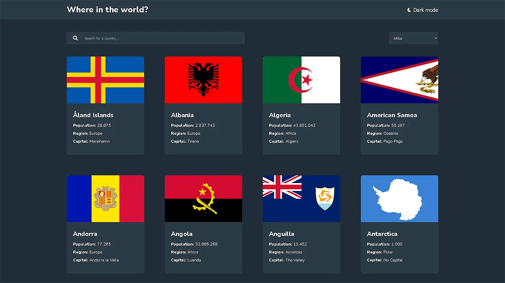
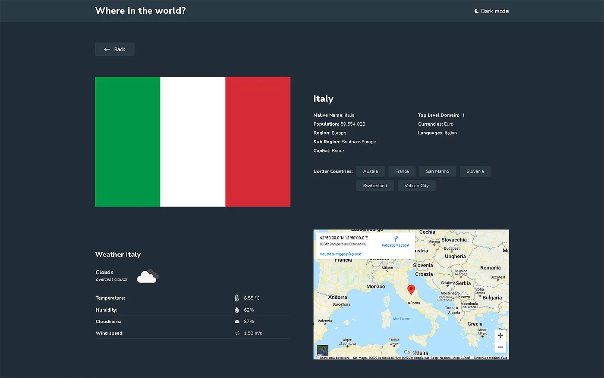
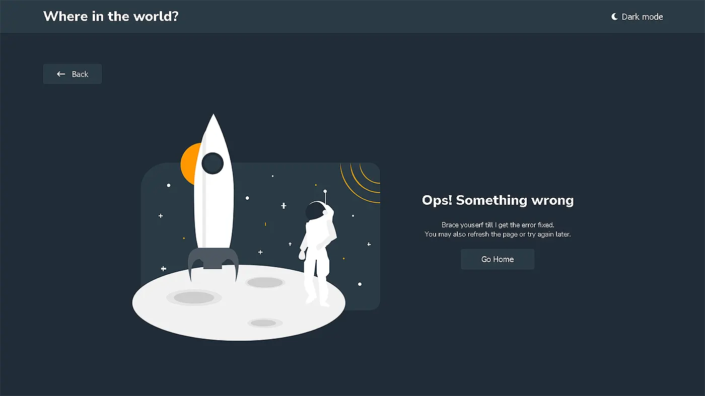

# React REST Countries & Weather API with color theme switcher



[](https://app.netlify.com/sites/denielden-react-countries-weather/deploys)

This is my evolved and most complex solution to the [REST Countries API with color theme switcher challenge on Frontend Mentor](https://www.frontendmentor.io/challenges/rest-countries-api-with-color-theme-switcher-5cacc469fec04111f7b848ca).

This application gives some information about all countries in the world, such us country data, weather and map. 

## Table of contents

- [Overview](#overview)
  - [About App](#about-app)
  - [Links](#links)
- [My process](#my-process)
  - [Built with](#built-with)
  - [What I learned](#what-i-learned)
  - [Continued development](#continued-development)
  - [Useful resources](#useful-resources)
- [Getting Started](#getting-started)
  - [System Requirements](#system-requirements)
  - [Installation](#installation)
  - [Bugs](#bugs)
  - [Contributing](#contributing)
- [Author](#author)

## Overview

### About App

This application gives some information about all countries in the world:

- See all countries from the API on the homepage
- Search for a country using an `input` field
- Filter countries by region
- Click on a country to see more detailed information on a separate page
- Click through to the border countries on the detail page
- Toggle the color scheme between light and dark mode

Additional features: 

- See current country weather data on detail page through API
  
- See the Map of the country on the details page
- Button scroll to top after the scrool
- Button for query reset when typing on the search input
- Error page with animated svg when no results found
  
- LocalStorage save of the set light or dark mode theme 

### Links

- Solution URL: [github](https://github.com/denielden/react-rest-countries-weather-api)
- Live Site URL: [live site](https://denielden-react-countries-weather.netlify.app)

## My process

### Built with

- Semantic HTML5 markup
- CSS custom properties
- Flexbox
- Css Grid
- Mobile-first workflow
- [React](https://reactjs.org/) - JS library
- [React Router](https://reactrouter.com/) - For routes
- [Styled Components](https://styled-components.com/) - For styles
- [React Spinners](https://www.npmjs.com/package/react-spinners)

### What I learned

I had a lot of fun in this challenge and I was able to learn how to:
- use **Router v6** and manage the error pages
- use **Styled Components** and how to write nested css or Media **Queries** inside it
  ```js
  const DivExample = styled.div`
    max-width: 32rem;
    background-color: var(--ele);
    transition: .4s ease-out;
    &:hover {
      transform: scale(1.1);
    }
    @media (max-width: 460px) {
      width: 100%;
    }
    h2 {
      margin-bottom: .8rem;
    }
  `;
  ```
- manage dark/light mode through **ThemeProvider** and global styles
  ```js
  import { ThemeProvider } from 'styled-components';
  import { darkTheme, lightTheme, GlobalStyles } from './theme';
  ```
- set image fit with the css property `object-fit: cover;`
  ```css
  img {
    aspect-ratio: 3.3 / 2;
    object-fit: cover;
  }
  ```

I practiced a lot with **React custom hooks** and learned how to:
- create a loading while retrieving the data
- save the chosen light-dark theme mode in the **localStorage**

Initially I had some problems in the details page because React didn't update the page content because I rightly didn't set the listening on the parameter that changed. 

### Continued development

Despite my extensive research I still have to figure out how I can create a preload at render time while react builds the page so that the "hops" due to `reset.css` are not seen as soon as the app is opened.

I also want to understand how to show an upload on the single image as it is uploaded. 

### Useful resources

- [React Router](https://reactrouter.com/docs/en/v6) - Docs
- [Styled Components](https://styled-components.com/docs) - Docs
- [REST Countries API](https://restcountries.com) - Docs
- [OpenWeather API](https://openweathermap.org/api) - Docs

## Getting Started

In order to view this project locally, you need to make sure you clone this repository and install it's dependencies.

### System Requirements

- [git][https://git-scm.com/] 2.34 or greater
- [node][https://nodejs.org/en/] 17.5 or greater
- [npm][https://nodejs.org/en/] 8.3.0 or greater

To check which versions you have installed you can run these commands:
```
git --version
node --version
npm --version
```
If requirements above are not installed in your computer, you'll need to install them. By clicking on them you can go to their website, which can lead you the way.

### Installation

- Clone the repository
  ```sh
  git clone https://github.com/denielden/react-rest-countries-weather-api.git
  ```
- Navigate to repository folder
  ```sh
  cd react-rest-countries-weather-api
  ```
- Install npm packages
  ```sh
  npm install
  ```
- To run the app in the development mode run in the project directory: 
  ```sh
  npm start
  ```

### Bugs

Please feel free to create an issue if you see a bug or something unexpected in the app.

### Contributing

- Fork the Project
- Create your Feature Branch (`git checkout -b feature/yourFeature`)
- Commit your Changes (`git commit -m 'Brief explanation of feature`')
- Push to the Branch (`git push origin feature/yourFeature`)
- Open a Pull Request

## Author

- Website - [denielden](https://denielden.github.io)
- Frontend Mentor - [@denielden](https://www.frontendmentor.io/profile/denielden)


## **Have fun building!** 🚀